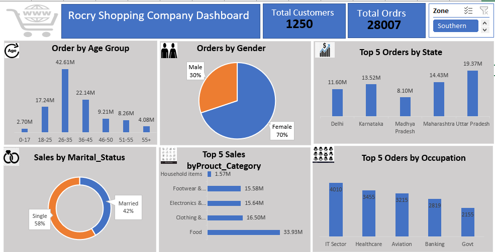

### Rocry_shopping_company_analysis

## Introduction

Rocry shopping is your one-stop destination for all your shopping needs. that offer a wide range of products, from fresh produce to household essentials, at affordable prices. the store goal is to provide excellent customer service, quality products, and a convenient shopping experience.

## Problem Statement 

The Objectives of this analysis is to calculate. 
- Total Customers

- Total Orders

- Top Orders by State

- Orders by gender

- Sales by marital status

 ## Skills Demostrated

  The following skills are demostrated

  - Excel for data profiling
    
  - PivotTable for KPIs
    
  - Silcers for filtering
    
  - Excel for data visualization

## Data Sourcing 

The dataset, sourced from online , is a CSV file containing a single table with 13 columns and 11,252 rows. To facilitate analysis, an 'age group' category was added to the dataset.

## Data Transformation 

The is a clean data. 

## Data modeling 
This is a single sheet therefore data modeling was not carried out. 

## Data Analysis and Visualization 

- Total number of Customers is 1250

- Total Orders is about 28007

- The age_group 26-35 tops the order

- Food tops the highest sales by product category

- Female gender buys more with about 70% over the male

- Uttar pradesh tops the highest sales by state

